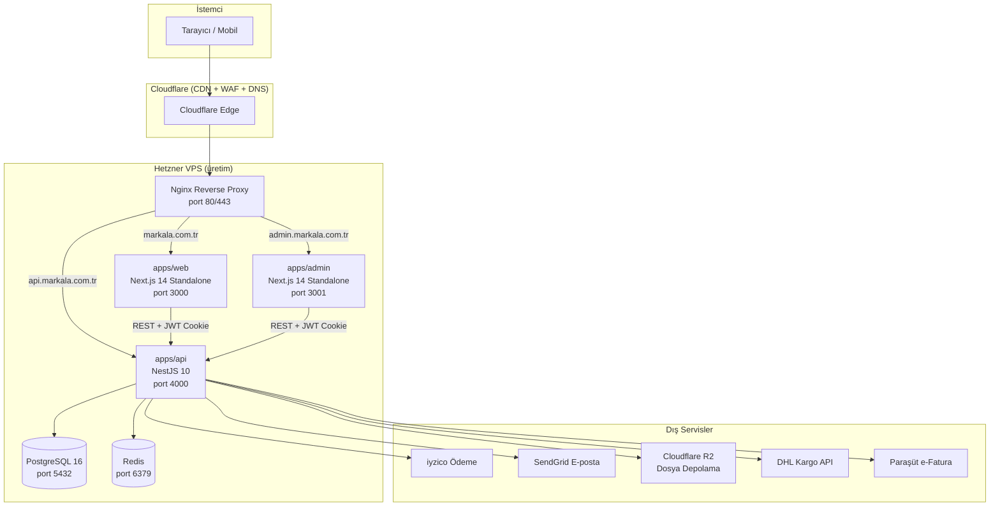
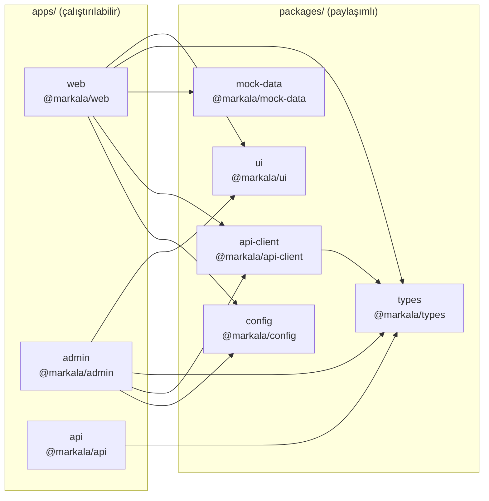
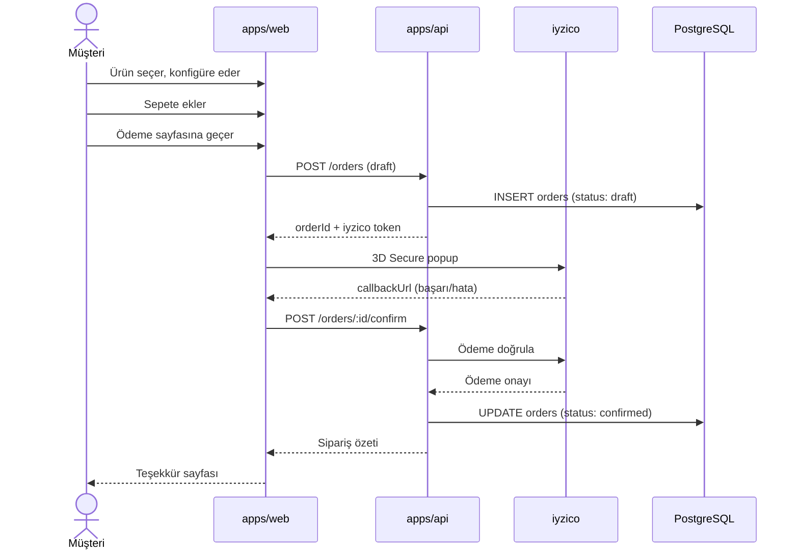
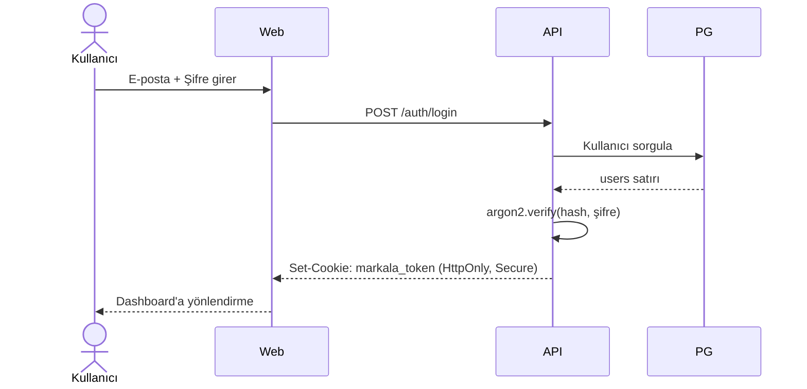
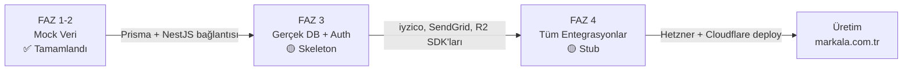

# Mimari Belgesi

**Markala** — matbaa ve reklam ürünleri e-ticaret platformu.
Son güncelleme: 2026-06-15

---

## Genel Bakış

Markala, **pnpm monorepo** üzerinde iki Next.js uygulaması ve bir NestJS API'sinden oluşur. FAZ 1-2'de mock veri, FAZ 3+'ta gerçek PostgreSQL + Redis stack'i kullanılır.

---

## Sistem Mimarisi



---

## Monorepo Yapısı



---

## Katman Detayları

### `apps/web` — Müşteri Storefront

| Teknoloji | Detay |
|-----------|-------|
| Framework | Next.js 14 (App Router) |
| Stil | Tailwind CSS + özel `paper/ink/brand` token |
| State | Zustand (sepet, auth, sipariş geçmişi) |
| 3D | React Three Fiber — hero animasyonları |
| İkonlar | Phosphor Icons |
| Test | Vitest (unit) + Playwright (e2e) |

**Sayfa Yapısı (App Router):**

```
app/
├── (marketing)/        # Anasayfa, hakkımızda, hizmetler, blog
├── kategori/[slug]/    # Kategori listeleme
├── urun/[slug]/        # Ürün detay + konfigüratör
├── sepet/              # Sepet drawer + sayfası
├── odeme/              # iyzico ödeme akışı
├── hesabim/            # Kullanıcı dashboard
├── yardim/             # Yardım merkezi makaleleri
└── api/                # Route handlers (mockup SVG, proxy)
```

### `apps/api` — NestJS REST API

| Teknoloji | Detay |
|-----------|-------|
| Framework | NestJS 10 |
| ORM | Prisma 5 |
| Veritabanı | PostgreSQL 16 |
| Cache/Queue | Redis (Bull queue) |
| Auth | argon2 şifre hash + JWT HttpOnly Cookie |
| Dökümantasyon | Swagger UI (`/api/docs`) |

**Modüller:**

```
api/src/
├── auth/           # JWT strateji, argon2 hash, oturum yönetimi
├── users/          # Kullanıcı CRUD, adres, sipariş geçmişi
├── products/       # Ürün kataloğu, varyant, fiyat
├── orders/         # Sipariş yaşam döngüsü, durum makinesi
├── payment/        # iyzico entegrasyonu (sandbox → üretim)
├── design/         # Tasarım dosyası yükleme (R2)
├── mail/           # SendGrid wrapper, template yönetimi
├── invoice/        # Paraşüt e-Fatura gönderimi
└── admin/          # Admin operasyonları (guard: AdminRole)
```

### `apps/admin` — Yönetim Paneli

Sipariş yönetimi, ürün CRUD, kullanıcı listesi ve tasarım dosyası onayı için dahili araç. `@markala/api-client` üzerinden API ile konuşur.

### `packages/ui` — Paylaşımlı Bileşenler

```
ui/src/
├── button.tsx
├── card.tsx
├── price.tsx       # TRY formatlaması (Intl.NumberFormat)
├── container.tsx
├── badge.tsx
└── index.ts        # Barrel export
```

### `packages/api-client` — Type-safe REST Client

```typescript
import { createMarkalaClient } from '@markala/api-client';

const client = createMarkalaClient({
  baseUrl: process.env.NEXT_PUBLIC_API_URL,
  getToken: () => getCookie('markala_token'),
});

const products = await client.products.list({ category: 'kartvizit' });
```

---

## Veri Akışı — Sipariş Oluşturma



---

## Auth Akışı



---

## Faz Geçiş Planı



### FAZ 3'te Mock → Gerçek Geçişi

| Bileşen | Mevcut (Mock) | Hedef (FAZ 3) |
|---------|--------------|---------------|
| Auth | Herhangi e-posta kabul | argon2 hash + JWT |
| Ödeme | Mock 3D Secure | iyzico sandbox → üretim |
| E-posta | Console log | SendGrid template |
| Dosya yükleme | Session'da ad saklanır | Cloudflare R2 bucket |
| Kupon | Sadece `HOSGELDIN` | DB'den dinamik kupon |
| Ürün verileri | `packages/mock-data` JSON | PostgreSQL + Prisma |

---

## Yerel Geliştirme Servisleri

`docker-compose.yml` ile ayağa kalkar:

| Servis | Port | Kullanım |
|--------|------|---------|
| PostgreSQL 16 | 5432 | API'nin DB bağlantısı |
| Redis | 6379 | Queue (Bull) + session |
| MailHog | 8025 (web), 1025 (SMTP) | E-posta önizleme |

---

## Güvenlik Notları

- JWT token'lar **HttpOnly, Secure, SameSite=Lax** cookie'de taşınır (XSS koruması)
- Tüm admin route'ları `AdminGuard` ile korunur
- Kullanıcı şifreleri `argon2id` ile hash'lenir
- iyzico 3D Secure — müşteri kart verisi hiçbir zaman sunucuya ulaşmaz
- R2 bucket — yalnızca imzalı URL ile erişim (`presigned URL`)

---

## İlgili Dökümanlar

| Döküman | İçerik |
|---------|--------|
| [ONBOARDING.md](./ONBOARDING.md) | Yeni geliştirici 1. gün kurulum rehberi |
| [DEPLOY.md](./DEPLOY.md) | Production deploy adımları |
| [RUNBOOK.md](./RUNBOOK.md) | Operasyon ve incident yönetimi |
| [MONITORING.md](./MONITORING.md) | Sentry, Zabbix, alert kuralları |
