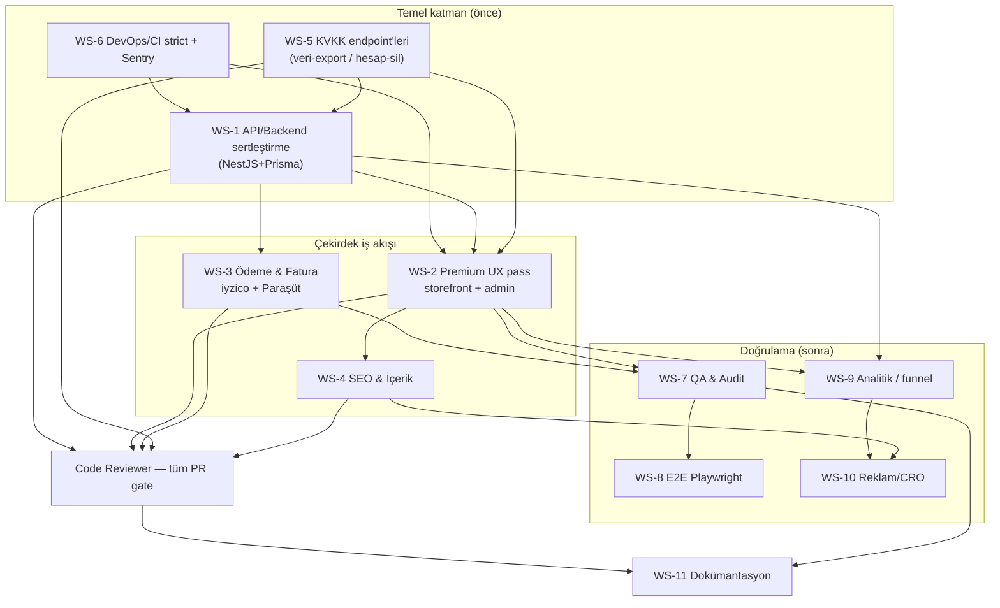

# Markala — Kurumsal Profesyonelleşme Sprinti · Bağımlılık Grafiği & Ekip Eşlemesi

> Sahip: Proje Yöneticisi ajanı · Koordinasyon issue: AJA-195
> Son güncelleme: 2026-06-16

Bu doküman, "Kurumsal Profesyonelleşme" sprintinin **gerçek ürün** (markala.com.tr matbaa & reklam e-ticaret monorepo'su) üzerine kurulu iş akışı haritasıdır. Sprint başlamadan önce iki bağlam tutarsızlığı tespit edildi; bunlar **Blocker** olarak işaretlendi ve Hasan onayı bekliyor.

---

## 0. ⛔ Sprint Öncesi Blocker'lar (önce çözülmeli)

Bu sprint, **18 ajanlı bir ekibin** koordinasyonudur. Ekibi tetiklemeden önce iki yapısal sorun var:

### B-1 · Ajan bağlamı yanlış projeye ait (CLAUDE.md kirlenmesi)
Runtime CLAUDE.md'sinde Markala'ya ait olmayan, başka bir projenin (**aisantral / bulut santral + çağrı analizi**) bağlamı yapıştırılmış: FreeSWITCH/FusionPBX, Celery, Whisper, ESL, RTP, dialplan, tenant/çağrı kuralları. **Gerçek repo bunların hiçbirini içermiyor** — Markala bir matbaa e-ticaret platformu (Next.js + NestJS + Prisma).
Etki: tetiklenen her ajan yanlış teknoloji ve görev varsayımıyla çalışır. Örneğin prompt'taki örnek bağımlılık grafiği (RTP test fix → ESL listener → FreeSWITCH disclosure) tamamen geçersiz.
**Aksiyon:** Markala CLAUDE.md'si bu projeye özel yeniden yazılmalı (PBX bloğu çıkarılmalı).

### B-2 · Ajan profilleri yanlış stack ile tanımlı
Workspace'teki 19 ajan, aisantral projesi için kurgulanmış görünüyor. Markala ile uyumsuzluklar:

| Ajan | Profil tanımı | Markala gerçeği | Durum |
|---|---|---|---|
| Backend Mühendisi | FastAPI, Alembic, Celery | **NestJS + Prisma** | ⚠️ Stack uyumsuz — yeniden brief |
| Frontend Mühendisi | "Galagoai frontend" | Markala Next.js 14 | ⚠️ Açıklama yanlış proje |
| Telefoni Operatörü | FreeSWITCH, IVR, CDR | matbaa e-ticarette yok | ❌ Kapsam dışı |
| AI ML Operator | Whisper, LLM router | matbaa e-ticarette yok | ❌ Kapsam dışı |
| İzleyici | cost per call/tenant | SaaS santral metriği | ❌ Kapsam dışı |

**Aksiyon:** Backend & Frontend ajanlarının açıklaması güncellenecek; PBX ajanları (Telefoni / AI ML / İzleyici) bu sprint için **beklemeye** alınacak veya e-ticaret rolüne yeniden tanımlanacak. Karar Hasan'a ait (ajan görev iptali/yeniden tanımı = Hasan onayı).

> Bu iki blocker çözülmeden alt-issue'lar **oluşturulmayacak** — aksi halde ekip bütçesi yanlış varsayımlı işe harcanır.

---

## 1. Gerçek Ürün Yüzeyi (envanter)

| Katman | Teknoloji | Kapsam |
|---|---|---|
| `apps/web` | Next.js 14 (App Router) | ~45 rota: ürün/kategori, sepet, ödeme, hesabım, blog, kurumsal, KVKK/yasal, matbaa/[il]/[ilçe] SEO landing |
| `apps/admin` | Next.js 14 | ~23 sayfa: ürün, sipariş, müşteri, kupon, kampanya, banner, blog, SSS, ayarlar, yorumlar |
| `apps/api` | NestJS + Prisma | auth, products, orders, users, reviews, legal, settings, stats + entegrasyonlar |
| Entegrasyon | — | iyzico, DHL, NetGSM, Paraşüt, R2, SendGrid (modüller mevcut) |
| CI | GitHub Actions | type-check (web/admin/api*), build (web/admin), Vitest unit (web). *API henüz strict değil |
| Test | Vitest | 25 test dosyası mevcut; E2E (Playwright) kapsamı düşük |

Tespit: Faz 3 (NestJS+Prisma gerçek veri) ve Faz 4 (entegrasyonlar) **büyük ölçüde kurulu**. Bu sprint greenfield değil → **sertleştirme, polish, kurumsal kalite**.

---

## 2. İş Akışları → Sahip Ajan Eşlemesi

| # | İş Akışı | Sahip Ajan | Çıktı |
|---|---|---|---|
| WS-1 | API/Backend sertleştirme (validasyon, hata yönetimi, strict type, gerçek veri) | Backend Mühendisi `c08f3c68` ⚠️ | NestJS modül auditi + PR'lar |
| WS-2 | Premium UX pass (storefront + admin: tutarlılık, a11y, mobil, loading/empty/error state) | Frontend Mühendisi `8edc1d49` | sayfa-bazlı UX PR'lar |
| WS-3 | Ödeme & Fatura akışı (iyzico checkout, Paraşüt e-fatura, sipariş→ödeme→onay) | Finans Muhasebe `bcdec37e` | uçtan uca ödeme doğrulama |
| WS-4 | SEO & İçerik (sitemap, JSON-LD, blog, matbaa/[il] landing, metadata) | Pazarlama & SEO `9a21ee1f` | SEO audit + PR'lar |
| WS-5 | KVKK & Yasal (aydınlatma, mesafeli satış, hesap-sil/veri-export akışı, çerez onayı) | KVKK Privacy Officer `d3fb84e6` | uyum checklist + PR'lar |
| WS-6 | DevOps & Güvenlik (CI strict, Sentry, deploy, CSP, 2FA, rate-limit) | DevOps & Güvenlik `4cd62a5f` | pipeline + güvenlik PR'lar |
| WS-7 | QA & Audit (regresyon, çekirdek akış denetimi, /health) | QA & Audit `55f5ce15` | hata raporu + retest |
| WS-8 | E2E test (Playwright golden path: keşif→sepet→ödeme→hesabım) | E2E User Test `0d2e022d` | E2E suite |
| WS-9 | Analitik (GA4, funnel, conversion event'leri) | DataOps Analitik `0bec2613` | event şeması + dashboard |
| WS-10 | Reklam/CRO (ad copy, landing CRO, REKLAM-ONCESI-TEST-PLANI) | Reklam Stratejisti `8d155965` | CRO önerileri |
| WS-11 | Dokümantasyon (API doc, kullanıcı kılavuzu, onboarding) | Teknik Yazar `bd224f75` | docs |
| WS-12 | SSL/DNS/e-posta auth (SPF/DKIM/DMARC, cert-monitor) | Sertifika DNS İzleyici `fcc27255` | sağlık raporu |
| — | Tüm PR review (kod yazmaz, severity'li) | Code Reviewer `98d6bb32` | onay/blok |
| — | Koordinasyon, sprint, çakışma, rapor | Proje Yöneticisi `3584f89c` (ben) | bu doküman + daily/weekly |
| ❌ | Kapsam dışı (bkz. B-2) | Telefoni `aaafe91d`, AI ML `ad1714d9`, İzleyici `550bedf8` | beklemede |

---

## 3. Bağımlılık Grafiği

**Kritik yol:** DevOps/CI → API sertleştirme → (Ödeme + UX) → QA → E2E. Reklam yayını (REKLAM-ONCESI-TEST-PLANI) bu zincir yeşil olmadan tetiklenmez.

---

## 4. Çakışma Riski Olan Ortak Dosyalar

| Dosya/alan | Çakışan akışlar | Kural |
|---|---|---|
| `packages/ui/*` (paylaşımlı bileşenler) | WS-2 (UX) + diğer tüm frontend | UX ajanı sahibi; diğerleri PR'da etiketler |
| `packages/types/*` | WS-1 (API) + WS-2 (Frontend) | Önce API tip değişikliği, sonra frontend tüketir |
| `apps/web/.../odeme/*` | WS-2 (UX) + WS-3 (Ödeme) | Önce WS-3 mantık, sonra WS-2 görsel |
| `.github/workflows/*` | WS-6 (DevOps) tek sahip | Başkası dokunamaz |
| `apps/web/.../(legal)/*`, `kvkk-*` | WS-5 (KVKK) tek sahip | UX sadece görsel, metin KVKK onaylı |
| `apps/api/src/prisma` (şema/migration) | WS-1 tek sahip | Migration + rollback zorunlu |

Çakışma çözüm sırası ve detaylar → `SPRINT-PLAN.md` §4.
